<p align="center">
  
</p>

<p align="center">
  Genetics, genomics and bioinformatics, grounded in clinical laboratory science.
</p>

---

## About

I am a medical laboratory technologist moving into genetics and bioinformatics. I am interested in how genomic variation and RNA regulation shape disease, and in turning raw sequence data into results that can inform diagnosis and treatment.

My clinical training in molecular diagnostics and hematology keeps my computational work grounded in how samples and data are actually generated. I use Python and R to analyse sequences, design PCR primers, and make analyses reproducible.

<table>
  <tr><td><b>Focus</b></td><td>Genetics, genomics, RNA biology, precision medicine</td></tr>
  <tr><td><b>Approach</b></td><td>Wet-lab molecular diagnostics combined with computational sequence analysis</td></tr>
  <tr><td><b>Education</b></td><td>BS Medical Laboratory Technology, Khyber Medical University, Peshawar<br>CGPA 3.88 / 4.00, top 5 in class</td></tr>
  <tr><td><b>Toolkit</b></td><td>Python (BioPython, primer3-py, pandas), R (ggplot2), SPSS v27, Git</td></tr>
  <tr><td><b>Now</b></td><td>Building sequence analysis tools and moving toward genomic data analysis</td></tr>
</table>

---

## Research Interests

| Area | What draws me to it |
|:---|:---|
| **Genomics & genetics** | How sequence variation relates to inherited disease and clinical phenotypes |
| **RNA biology & editing** | Programmable ADAR-mediated editing, guide RNA design, and RNA-based therapeutics |
| **Molecular diagnostics** | PCR and primer design, assay development, and turning findings into testing |
| **Bioinformatics** | Sequence analysis, statistics, and reproducible pipelines |
| **Precision medicine** | Using genetic information to guide diagnosis and treatment |
| **Hemoglobin disorders** | The genetics and clinical burden of β-thalassemia |

---

## Computational Toolkit

<p>
  
</p>

| Task | Tools |
|:---|:---|
| Sequence analysis | Python, BioPython |
| Database queries | BioPython (NCBI, ExPASy, KEGG, PDB) |
| Primer design | primer3-py |
| Data handling | pandas |
| Statistics & visualization | R (ggplot2), SPSS v27 |
| Workflow | Git, GitHub, VS Code |

---

## Featured Projects

| Project | Focus | Tools |
|:---|:---|:---|
| **[genomic-sequence-analysis-toolkit](https://github.com/hamzamlt-03/genomic-sequence-analysis-toolkit)** | Python toolkit for DNA sequence analysis: validation, nucleotide composition, GC content, motif detection, ORF identification, translation, and reverse complement | Python, BioPython |
| **[tp53-automated-primer-design](https://github.com/hamzamlt-03/tp53-automated-primer-design)** | End-to-end pipeline for automated PCR primer design for *TP53*, with data visualisation | Python, primer3-py, R (ggplot2) |
| **[bioinformatics-database-querying](https://github.com/hamzamlt-03/bioinformatics-database-querying)** | Genomic data analysis with automated NCBI, ExPASy, KEGG and PDB queries on the SARS-CoV-2 spike protein | Python, BioPython, Jupyter |
| **RNA Editing Review** | Narrative review of guide RNA engineering, chemical modification, and immune sensing in programmable ADAR-mediated RNA editing | RNA biology, ADAR |
| **[Psychosocial Challenges in Transfusion-Dependent β-Thalassemia](https://github.com/hamzamlt-03/tdt-thalassemia-analysis)** | Cross-sectional study of quality of life, psychosocial burden, and caregiver burden in affected children | R, SPSS |
| **Sub-Acute Inhalational Toxicology** | Experimental study of household pyrethroid insecticide exposure, with biochemical and histopathological analysis | Biochemistry, histopathology |

---

## Currently Learning

```text
Python → BioPython → DNA/RNA Sequence Analysis → Genomic Data Analysis
       → Bioinformatics → Computational Biology → Precision Medicine
```

---

## GitHub Analytics

<p align="center">
  
  
</p>

---

## Contact

<p align="center">
  <a href="https://github.com/hamzamlt-03">GitHub</a> &nbsp;·&nbsp;
  <a href="https://www.linkedin.com/in/m-hamza-mlt">LinkedIn</a> &nbsp;·&nbsp;
  <a href="mailto:m.hamza.mlt.pk@gmail.com">Email</a> &nbsp;·&nbsp;
  <a href="https://orcid.org/0009-0005-1435-2853">ORCID</a>
</p>

<p align="center"><sub>From the laboratory bench to genomic data.</sub></p>
